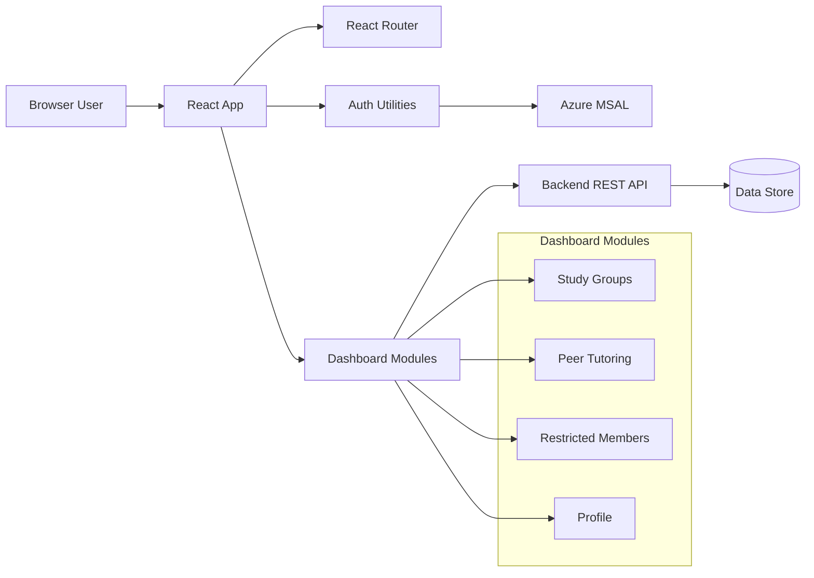

# PeerConnect Frontend Developer Onboarding

This guide helps new contributors set up, run, test, and troubleshoot the frontend quickly.

## 1. Quick Start

Prerequisites:
- Node.js 20+
- npm 10+
- Backend API running (default: `http://localhost:8080`)

Install and run:

```bash
npm install
npm run dev
```

Alternative Windows launcher:

```bash
./start.bat
```

Open the app at:
- `http://localhost:5173`

## 2. Environment Setup

Development API base URL is read from `env.development`:

```env
VITE_API_BASE=http://localhost:8080
```

If backend runs elsewhere, update `VITE_API_BASE` before starting Vite.

## 3. Project Layout

- `src/pages` : Route-level pages and large dashboard modules
- `src/components` : Shared UI components and layout shell
- `src/styles` : Global, page, and component CSS
- `src/utils` : Auth and shared client-side utilities
- `src/__tests__` : Unit/integration tests
- `e2e` : Playwright end-to-end specs

## 4. Runtime Architecture



## 5. Core Module Behavior

- Study Groups and Peer Tutoring render within the same page module (`Home.jsx`) using internal `activeModule` state.
- Restricted Members is now integrated into the same dashboard module pattern and no longer requires a separate route screen.
- Profile avatar updates propagate across modules via profile sync utilities.

## 6. Common Commands

```bash
npm run dev        # local development
npm run lint       # eslint checks
npm run test       # vitest watch mode
npm run test:run   # vitest single run
npm run build      # production build
npm run preview    # preview production build
npx playwright test
```

## 7. Daily Workflow

1. Pull latest changes.
2. Run `npm install` if dependencies changed.
3. Run `npm run dev` and verify backend connectivity.
4. Make focused changes in `src/pages`, `src/components`, and `src/styles`.
5. Run `npm run lint` and `npm run test:run`.
6. For flow-level UI changes, run targeted Playwright specs in `e2e`.

## 8. Troubleshooting

### App does not load data
- Verify backend is running.
- Confirm `VITE_API_BASE` points to backend origin.
- Check browser Network tab for `401`, `403`, `404`, or CORS errors.

### `./start.bat` fails
- Ensure Node and npm are installed and on PATH.
- The script kills listeners on ports `5173` and `5174`; rerun terminal as admin if process kill is blocked.
- Run `npm run dev` directly to compare behavior.

### Login/session issues
- Confirm MSAL configuration is correct in auth config files.
- Clear stale browser storage/session and re-authenticate.

### Avatar or profile display looks stale
- Revisit profile update flow and profile sync utility events.
- Ensure API responses include avatar-related fields expected by frontend extraction logic.

## 9. Suggested First Tasks for New Contributors

- Add or update one unit test under `src/__tests__`.
- Fix one UI polish issue in dashboard modules.
- Run one e2e test and document any failure patterns.

## 10. Related Docs

- `README.md` : Project overview and run/test basics
- `ProjectReference.md` : Product and requirement background
